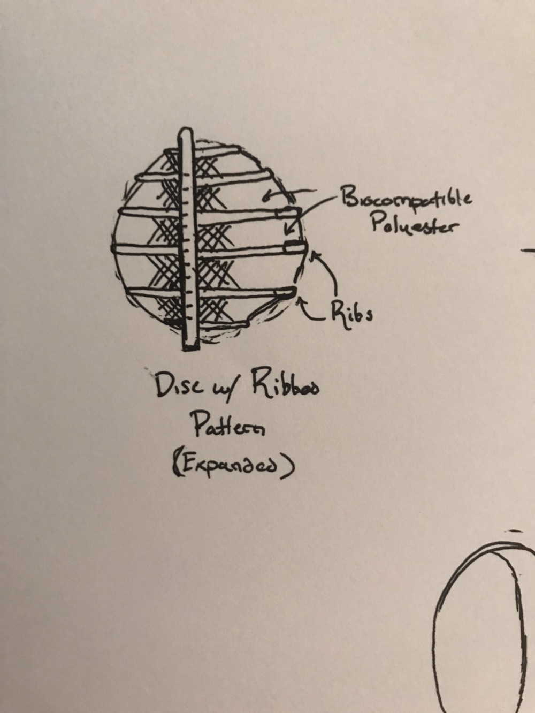

# **Minimally-Invasive-Monocusp-Valve** *repository*
This repository holds all the files for the final BMEN 3310 Project.  

Included Languages:
* C++
* Python
* MATlab

## The Heart Valve Hand Drawn Picture

