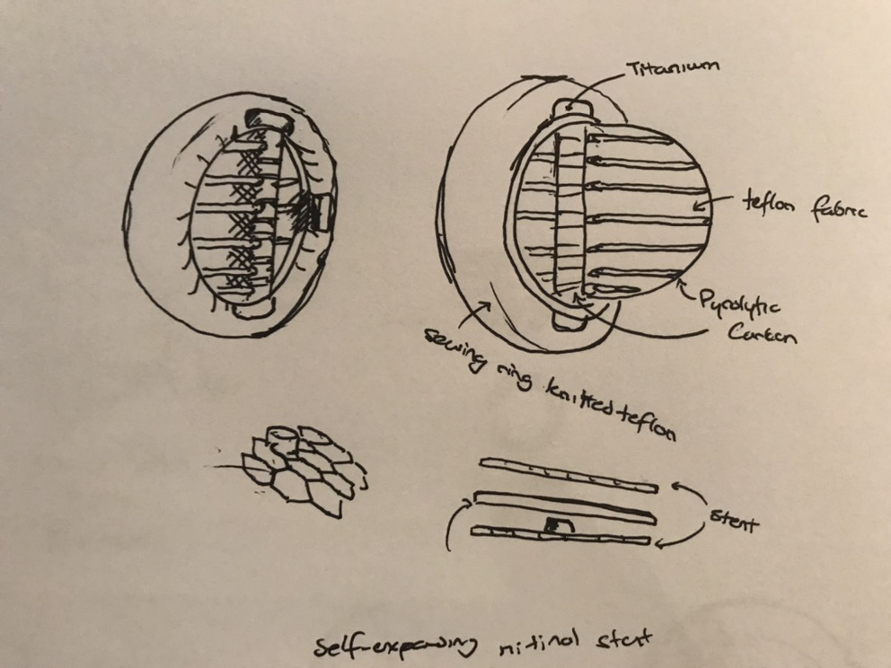
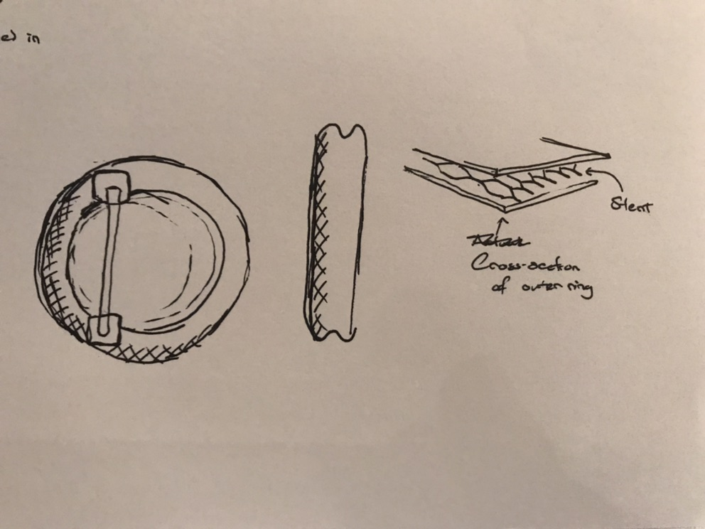

# **Minimally-Invasive-Monocusp-Valve** *repository*
This repository holds all the files for the final BMEN 3310 Project.  

Included Languages:
* C++
* Python
* MATlab

## Contributors  
<table style = "width:100%" align="center">
  <th><a href="https://www.linkedin.com/in/tyleradammartinez/" class="link">Tyler Adam Martinez</a></th>  
  <th>Mason Forshage</th>
  <th>Adrian Rodriguez</th> 
  </tr><tr>
  <td></td>
  <td></td>
  <td></td>
  </tr>
  <td>Coding, Sensor Circuity, and  Hemodynamic Parameter Analysis</td>
  <td>CAD Design, Illustration, and Materials</td>
  <td>Mechanics, Presentation, and CAD Analysis</td>
</table>

## The Heart Valve Hand Drawn Picture

